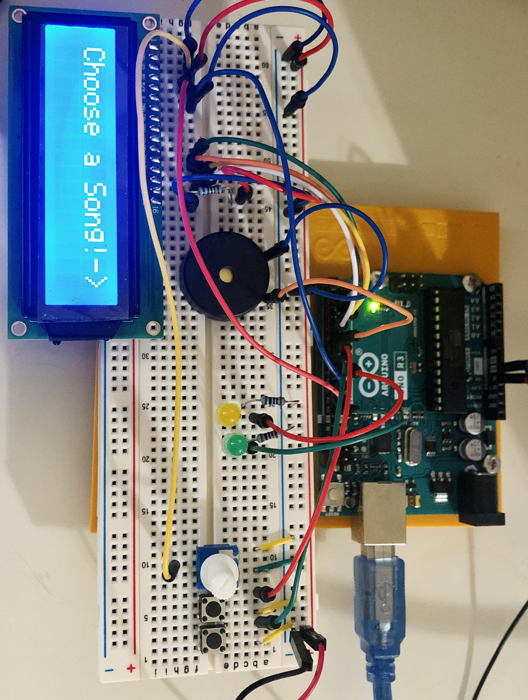

# JUKEBOX

hi! today we're playing with a piezo and an LCD. this jukebox exhibits disney songs like "Part of Your World", "Love is an Open Door", and "The Bare Necessities". it also has "Alouette" just for fun.

# tools used
- piezo x 1
- potentiometer x 1   
- LED x 2  
- 220Ω Resistor x 3  
- button x 2
- jumper wires
- breadboard
- sheet music for songs (found through google images)

## how it works
**pot**: controls the contrast on LCD
**button_LEFT**: cycles through the list of songs
**button_RIGHT**: play selected song
**yellow LED**: lights up when C5 note plays XD
**green LED**: lights up when D5 note plays XD

## what i learned
- this piezo can only play a certain range of frequencies. for my needs, it only played C4-B4 notes. so to show that a C5 and a D5 note is being played, I added LEDs lmao
- how to use LiquidCrystal.h for LCD
- how to play a note on piezo
- that hashmaps are probably unnecessary for Arduino use because it still takes up too much space

## how to run
1. i assume you know how to install the arduino IDE.
2. open the file on arduino IDE.
3. connect them accordingly
4. upload the file to the arduino!
